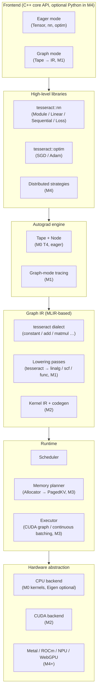
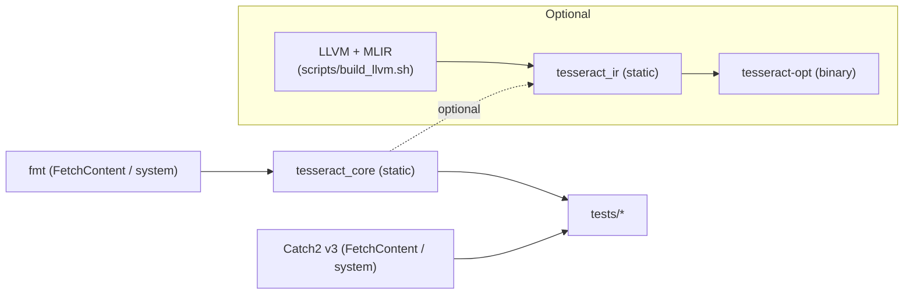

# Tesseract architecture

This document describes the code-level shape of the framework as it stands at
the end of **M0**, and how each layer is intended to evolve through M5. It is
the canonical technical companion to [`idea.md`](../idea.md), which carries
the strategic argument and roadmap.

---

## 1. Layered view

**Invariants to preserve as the stack grows.**

- The tensor value-semantic handle (`tesseract::Tensor`) never changes size or
  alignment; adding a backend must not require header-level changes to the
  core API.
- The *same* Graph IR expresses both training and inference. Runtime features
  like KV-cache paging and continuous batching are IR attributes + passes,
  not a separate code path.
- Every module must be linkable without MLIR (`TESSERACT_ENABLE_MLIR=OFF`).
  The IR layer is the *only* place that may depend on LLVM headers.

---

## 2. Module reference (M0)

### 2.1 `tesseract::core`

| File                                         | Responsibility                                     |
|----------------------------------------------|----------------------------------------------------|
| `include/tesseract/core/DType.hpp`           | Scalar dtype enumeration + size/name/predicates.   |
| `include/tesseract/core/Device.hpp`          | `Device = (DeviceType, index)`. CPU only at M0.    |
| `include/tesseract/core/Shape.hpp`           | Inline-stored (`kMaxRank=8`) dim/stride container. |
| `include/tesseract/core/Allocator.hpp`       | `Allocator` abstract + `CpuAllocator` impl.        |
| `include/tesseract/core/Storage.hpp`         | Owning or borrowed byte buffer on a device.        |
| `include/tesseract/core/Tensor.hpp`          | `Tensor` value handle + `TensorImpl`.              |

Design decisions locked in M0 (do not break casually):

- **Value semantics with shared state.** A `Tensor` is a thin wrapper around
  `std::shared_ptr<TensorImpl>`. Copying a tensor shares storage; `clone()`
  explicitly deep-copies.
- **Views don't allocate.** `view`, `reshape` (when contiguous), `permute`,
  `transpose` all return new `Tensor` handles pointing at the same `Storage`
  with different shape/stride metadata. `contiguous()` is the only op that
  may trigger a copy.
- **`AutogradMeta` is forward-declared** in `Tensor.hpp`; the full definition
  lives under `include/tesseract/autograd/` and is expanded in M0 T4. This
  keeps the core build free of autograd-specific type deps.

### 2.2 `tesseract::autograd` (placeholder)

M0 ships an inert `AutogradMeta` type. The full engine (M0 T4) introduces:

- `Node`: base class for per-op reverse kernels.
- `Engine::backward(root, grad)`: topological-order traversal with gradient
  accumulation.
- `NoGradGuard`: RAII scope that disables tape recording.

### 2.3 `tesseract::ir`

Opt-in (`TESSERACT_ENABLE_MLIR=ON`). Placeholder dialect registering three
ops so that the dialect registration, TableGen pipeline, and `tesseract-opt`
driver all work end to end before the M1 lowering work begins.

- `src/ir/TesseractDialect.td` → dialect declaration.
- `src/ir/TesseractOps.td`     → `constant`, `add`, `matmul` op definitions.
- `src/ir/tesseract-opt.cpp`   → `mlir-opt`-style driver.

### 2.4 Tests

- Catch2-based unit tests under `tests/core/`, one file per header.
- `tests/smoke/test_smoke.cpp` is a link-only smoke test guaranteed to stay
  green; do not delete.
- `tests/ir/roundtrip.mlir` is the M0 MLIR sanity check; only executed when
  `TESSERACT_ENABLE_MLIR=ON`.

---

## 3. Build graph

---

## 4. Forward compatibility hints

- **Dtype additions.** `DType` enum already reserves slots for
  `Float16`/`BFloat16`/`Float8_E4M3`/`Float8_E5M2`/`Int8`/`UInt8`/`Int4`; just
  flip `implemented=true` in `src/core/DType.cpp` and wire kernels.
- **Device additions.** `DeviceType` reserves `CUDA`/`Metal`/`NPU`. Register
  allocators via `default_allocator_for(Device)`.
- **Graph mode.** Eager `Node` classes (T4) will be reused as tracing nodes
  for graph capture. The IR layer subclass of `Node` materializes
  `tesseract.*` ops instead of running kernels.
- **Autograd 2.0 (functorch-style).** Anticipated by keeping `AutogradMeta`
  strictly per-tensor and never leaking into the core struct's public API.

---

## 5. Open questions (tracked via ADRs)

- **ADR-0001** use MLIR as the shared IR (accepted).
- **ADR-0002** autograd execution model — tape vs. graph (pending, lands
  with T4).
- **ADR-0003** naming and ABI conventions — pending open-source milestone.
